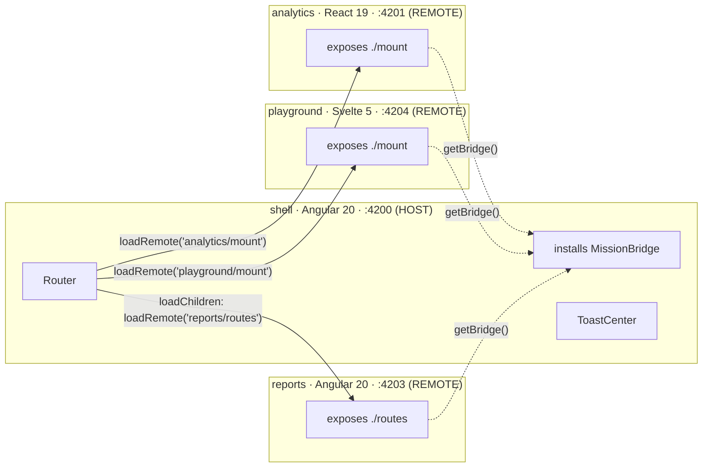

# Mission Control — Architecture

This document is the map of the system. It is written to be equally useful to a human reviewer and to an AI agent asked to extend the codebase. **If a contract is not described here or exported from `@mission/bridge`, it does not exist.**

## Federation graph



- The shell consumes remotes **only** via their MF 2.0 manifests (`analytics@http://localhost:4201/mf-manifest.json`, `reports@…4203/…`).
- Remotes consume the host **only** via `getBridge()` from `@mission/bridge`.
- Remotes never reference each other. Shared state rendezvous happens on bridge contracts (e.g. the `fleet-data` cache key).

## Shared singletons (declared in every app's `rsbuild.config.ts`)

| Share key | Version req | Why singleton |
| --- | --- | --- |
| `monaco-editor` | `^0.52.0` | One editor download for the whole federation; `monaco.editor.setTheme()` flips every editor at once. |
| `@mission/bridge` | workspace (`requiredVersion: false`) | The contract itself. Identity is *additionally* anchored to `globalThis[Symbol.for('mission-control.bridge.v1')]`, so even a duplicated module copy resolves the same bridge. |
| `@angular/*`, `rxjs` | `^20`, `^7.8` | shell + reports run in ONE Angular instance (federated routes require it). |
| `react`, `react-dom` | `^19` | Future React remotes reuse analytics' copy. |
| `svelte` | `^5` | Future Svelte remotes reuse playground's copy. |

## The bridge (`packages/bridge`)

| Contract | Owner | Remote surface |
| --- | --- | --- |
| `EventBus` (`MissionEventMap`) | host instance | `on/once/emit/onAny`. All cross-MFE events are declared in `MissionEventMap` — add events there first. |
| `SessionFacade` | shell (`SessionController` stays host-private) | read-only `user`, `can(permission)`, `authorizeRequest(init)`, `subscribe`. **Tokens live in a host closure; remotes never store them.** |
| `ThemeChannel` | shell applies `html[data-theme]` + persistence | `current`, `set/toggle`, `subscribe` (fires immediately by default). Monaco themes hang off this. |
| `DataCache` (SWR) | host instance | `fetch(key, fetcher, {staleMs, ttlMs})` with in-flight dedupe → cross-remote requests for the same key cost one network call. `peek/set/invalidate/subscribe/keys`. |
| `TaskManager` | host instance | `start(descriptor)` — the poll closure executes in the host, survives remote unmount, broadcasts `task:*` events, lands results in the `DataCache` under `cacheKey`, and carries a `resultRoute` for the shell's toast deep-link. |
| Route validators | pure functions | `requireAuth`, `requirePermission`, `composeValidators`, `evaluateRoute`. Apps write 3-line adapters: Angular `CanActivateFn` (`apps/reports/src/app/shared/bridge-guard.ts`), React `<Protected>` (`apps/analytics/src/routing/Protected.tsx`). |
| HTTP interceptors | pure functions | `createAuthInterceptor(session)`, `createOriginInterceptor(app)`, `createHttpClient({interceptors, fetchImpl})`. The Angular `HttpInterceptorFn` adapter lives in `apps/reports/src/app/shared/mission-auth.interceptor.ts`. |

**Boot order:** the shell calls `initHostBridge()` (→ `createMissionBridge()` + `installBridge()`) *before* Angular bootstraps and before any remote loads. Standalone remotes install a local dev bridge in their `bootstrap` file when `!hasBridge()` — same contracts, no host.

## Cross-framework routing

- **reports (Angular → Angular):** exposes a `Routes` array; the shell lazy-loads it with `loadChildren`. Guards and route-level `provideHttpClient(withInterceptors(...))` travel with the routes.
- **analytics (React) & playground (Svelte) in the Angular host:** both expose the framework-agnostic `mount(el, {basename}) => unmount` contract, consumed by ONE generic `RemoteMountOutletComponent` — the shell has no idea which framework renders inside. Each is mounted through a URL **matcher** that swallows `/analytics/**` / `/playground/**`. The React and Svelte adapters render an inline access-denied panel for blocked views; the Angular adapter redirects to the shell's `/forbidden`. All three consume the *same* bridge validators.

## Monaco strategy

- `monaco-editor` is a **shared singleton** (`^0.52.0`) in all three configs — the first app to need it wins, everyone else reuses that copy.
- Workers use the **native Rspack pattern** in each remote (no custom plugins):
  ```ts
  new Worker(new URL('monaco-editor/esm/vs/editor/editor.worker.js', import.meta.url))
  ```
  Each remote bundles its own worker chunks on its own origin (`apps/*/src/**/monaco*setup.ts`) and handles every label it needs (base editor, JSON in reports/analytics, CSS + HTML in playground), so `window.MonacoEnvironment` stays correct regardless of which remote installed it last.
- Multi-document editing (playground): ONE editor instance, one `ITextModel` per file — `editor.setModel()` swaps content, language services, syntax highlighting and undo stack in a single call.
- Theme: components subscribe to `ThemeChannel` and call `monaco.editor.setTheme('vs' | 'vs-dark')` — global by design, one call restyles every editor in the federation.

## Build-system decisions (the sharp edges)

1. **Async boundary is mandatory.** Every entry is `main.ts → void import('./bootstrap')`. Without it, MF 2.0 throws `loadShareSync failed` because shared singletons can't be negotiated before the first shared import executes.
2. **`{ environment: 'browser' }` on `pluginModuleFederation`.** `@nx/angular-rsbuild` names its Rsbuild environment `browser`; the MF plugin defaults to `web` and silently no-ops otherwise.
3. **`createConfig` must be exported as a function** (`export default () => createConfig(...)`) — it returns a Promise, which Rsbuild's config loader rejects at the top level.
4. **zone.js is required** — the Angular-Rsbuild toolchain appends it to the browser polyfills unconditionally; zoneless bootstrap is not supported here.
5. **MF DTS generation is disabled** (`dts: false`). Remote types are hand-declared in `apps/shell/src/remotes.d.ts`; the generated `@mf-types` churn re-triggers the dev watcher.
6. **Dev `assetPrefix` is absolute** on remotes (`http://localhost:4201/`, `…4203/`) so federated chunks, CSS and worker files resolve against the remote's own origin when running inside the shell, with CORS enabled on the remote dev servers.

## Untrusted content (playground canvas)

Everything typed into the playground editor is treated as hostile. The render path is: editor → `sanitizeHtml` (DOMPurify: scripts, event handlers, dangerous URLs and embed/style/link/base/meta tags stripped) + `sanitizeCss` (comment-stripping first, then `@import` / `expression()` / `behavior:` / `javascript:` URL / style-breakout filters) → a **shadow root**, markup via `innerHTML`, CSS via a real style element's `textContent`. The shadow boundary keeps canvas styles from leaking into the shell; `@mission/tokens` custom properties intentionally pierce it so previews follow the global theme. The CSS filter is POC-grade — a production system would use a real CSS parser.

## Machine-readable manifests

Every remote build emits `dist/mf-manifest.json` — name, exposes, shared (with version + singleton flags), asset lists. Treat it as the ground truth of what a build provides/consumes; the reports remote even renders its own manifest in the UI (*Federation self-inspection*).

## Extending the system (checklist for agents)

1. New cross-MFE event? Add it to `MissionEventMap` in `packages/bridge/src/types.ts` first.
2. New shared dataset? Pick a cache key, document it next to `FLEET_CACHE_KEY`, and use `cache.fetch` in every consumer — never a bare `fetch`.
3. New remote? Copy a remote's `rsbuild.config.ts` (keep the shared map identical), expose a `./mount` (non-Angular) or `./routes` (Angular), register it in the shell's `remotes` + `app.routes.ts`, and declare its types in `remotes.d.ts`.
4. New protected route? Compose validators from `@mission/bridge`; never hand-roll permission checks in a remote.
5. Never import across remotes. If two remotes need the same thing, it belongs in the bridge or behind a cache key.
